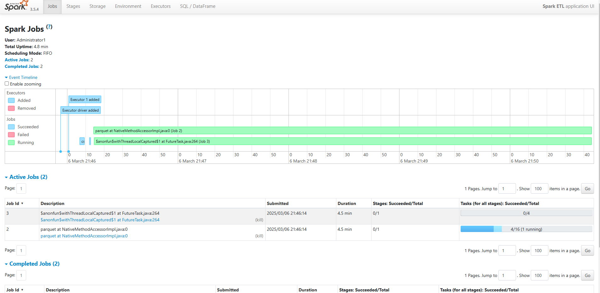
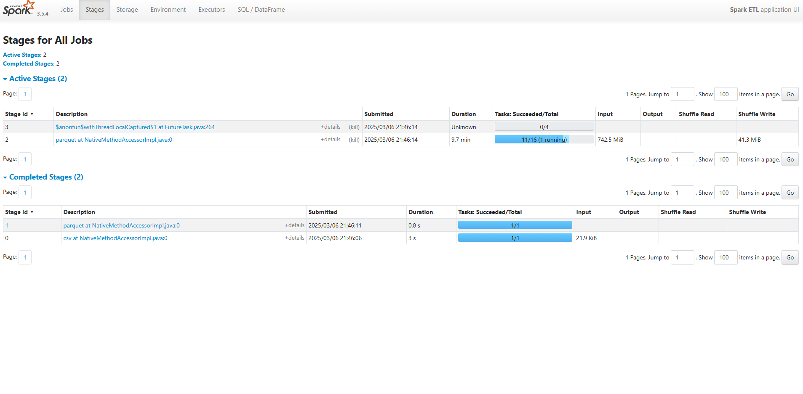
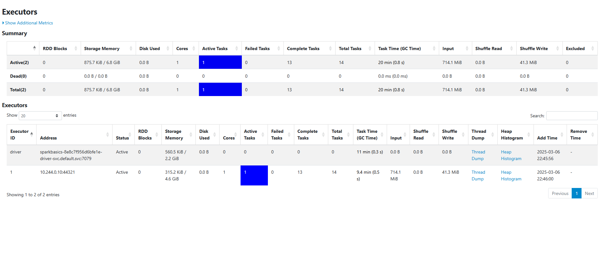
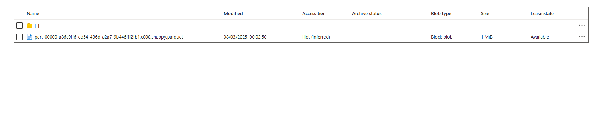
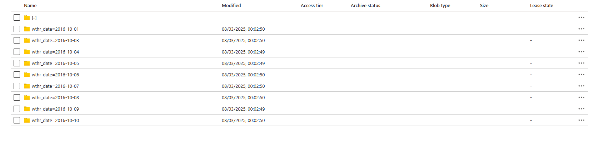
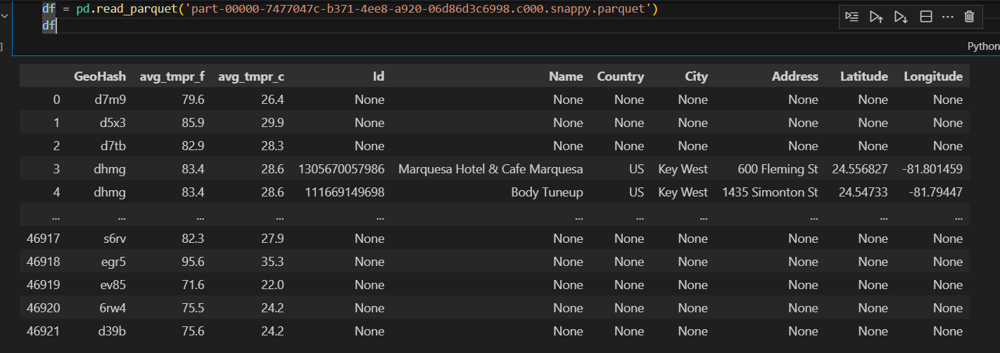

<h1>Spark Basic Homework</h1>

# Developed code
In the repository, you can find the code for a PySpark application and a Docker file for image creation. https://github.com/SzymonHendzel/SparkBasciHomework/tree/main

# Azure resources 
Using Terraform, I created the necessary resources. I attach the resource list from AZ CLI. I changed the configuration of the VM to 'Standard_E4s_v3' to meet the application's resource demands.

```
Name                                  ResourceGroup                                                 Location    Type                           
                   Status
------------------------------------  ------------------------------------------------------------  ----------  ------------------------------------------------  --------
sparkexercises01                      SparkExercises                                                westeurope  Microsoft.Storage/storageAccounts
NetworkWatcher_westeurope             NetworkWatcherRG                                              westeurope  Microsoft.Network/networkWatchers
stdevwesteurope2g87                   rg-dev-westeurope-2g87                                        westeurope  Microsoft.Storage/storageAccounts
aks-dev-westeurope-2g87               rg-dev-westeurope-2g87                                        westeurope  Microsoft.ContainerService/managedClusters
acrdevwesteurope2g87                  rg-dev-westeurope-2g87                                        westeurope  Microsoft.ContainerRegistry/registries
5c00e7fc-fe52-496a-85d5-0eea2f8e4eb4  MC_rg-dev-westeurope-2g87_aks-dev-westeurope-2g87_westeurope  westeurope  Microsoft.Network/publicIPAddresses
kubernetes                            MC_rg-dev-westeurope-2g87_aks-dev-westeurope-2g87_westeurope  westeurope  Microsoft.Network/loadBalancersaks-dev-westeurope-2g87-agentpool     MC_rg-dev-westeurope-2g87_aks-dev-westeurope-2g87_westeurope  westeurope  Microsoft.ManagedIdentity/userAssignedIdentities
aks-agentpool-59659103-nsg            MC_rg-dev-westeurope-2g87_aks-dev-westeurope-2g87_westeurope  westeurope  Microsoft.Network/networkSecurityGroups
aks-vnet-59659103                     MC_rg-dev-westeurope-2g87_aks-dev-westeurope-2g87_westeurope  westeurope  Microsoft.Network/virtualNetworks
aks-default-30724526-vmss             MC_rg-dev-westeurope-2g87_aks-dev-westeurope-2g87_westeurope  westeurope  Microsoft.Compute/virtualMachineScaleSets
```

# Kubernetes pod logs
I deployed and started the application on the Kubernetes cluster. I attached the logs for the running pod. I parameterized the credentials as Spark environment variables, which are passed during the application startup.
```
Kubernetes logs 
Name:             sparkbasics-8e8c7f956d6bfe1e-driver
Namespace:        default
Priority:         0
Service Account:  spark
Node:             aks-default-94950290-vmss000000/10.224.0.4
Start Time:       Thu, 06 Mar 2025 22:45:48 +0100
Labels:           spark-app-name=sparkbasics
                  spark-app-selector=spark-8070e96ad439431082f14e975b4c6ddc
                  spark-role=driver
                  spark-version=3.5.4
Annotations:      <none>
Status:           Running
IP:               10.244.0.67
IPs:
  IP:  10.244.0.67
Containers:
  spark-kubernetes-driver:
    Container ID:  containerd://205c2dbebb20a395368aacbd93db5de6b200b502d4f5789a15583d9f73afd917
    Image:         acrdevwesteuropeoxan.azurecr.io/my_app2
    Image ID:      acrdevwesteuropeoxan.azurecr.io/my_app2@sha256:5ae67bc62543ad9061673de4571b6e2be87b78feb483c029e7e4a0094a5f1dd4
    Ports:         7078/TCP, 7079/TCP, 4040/TCP
    Host Ports:    0/TCP, 0/TCP, 0/TCP
    Args:
      driver
      --properties-file
      /opt/spark/conf/spark.properties
      --class
      org.apache.spark.deploy.PythonRunner
      local:///opt/spark-3.5.4-bin-without-hadoop/work-dir/main.py
    State:          Running
      Started:      Thu, 06 Mar 2025 22:45:50 +0100
    Ready:          True
    Restart Count:  0
    Limits:
      memory:  5734Mi
    Requests:
      cpu:     1
      memory:  5734Mi
    Environment:
      SPARK_USER:                 Administrator1
      SPARK_APPLICATION_ID:       spark-8070e96ad439431082f14e975b4c6ddc
      STORAGE_ACCOUNT_NAME_OUT:   stdevwesteuropeoxan
      STORAGE_KEY_OUT:            xxxxxxxxxxxxxxxxxxxxxxxxxxxxxxxxxxxxxxxxxxxxxxxxxxxxxxxxxxxxxxxxxxxxxxxxxxxxxxxxxxxxxxxxxxx
      CONTAINER_NAME_IN:          tfstate
      STORAGE_ACCOUNT_NAME_IN:    sparkexercises01
      STORAGE_KEY_IN:             xxxxxxxxxxxxxxxxxxxxxxxxxxxxxxxxxxxxxxxxxxxxxxxxxxxxxxxxxxxxxxxxxxxxxxxxxxxxxxxxxxxxxxxxxxx
      GEO_API_KEY:                xxxxxxxxxxxxxxxxxxxxxxxxxxxxxxxxxxxxxxxxxxxxxxxxxxxxxxxxxxxxxxxxxxxxxxxxxxxxxxxxxxxxxxxxxxx
      CONTAINER_NAME_OUT:         data
      SPARK_DRIVER_BIND_ADDRESS:   (v1:status.podIP)
      SPARK_LOCAL_DIRS:           /var/data/spark-3597d2ed-3bf3-4b4c-8d23-5301c9e4d4fa
      SPARK_CONF_DIR:             /opt/spark/conf
    Mounts:
      /opt/spark/conf from spark-conf-volume-driver (rw)
      /var/data/spark-3597d2ed-3bf3-4b4c-8d23-5301c9e4d4fa from spark-local-dir-1 (rw)
      /var/run/secrets/kubernetes.io/serviceaccount from kube-api-access-tzhk2 (ro)
Conditions:
  Type                        Status
  PodReadyToStartContainers   True
  Initialized                 True
  Ready                       True
  ContainersReady             True
  PodScheduled                True
Volumes:
  spark-local-dir-1:
    Type:       EmptyDir (a temporary directory that shares a pod's lifetime)
    Medium:
    SizeLimit:  <unset>
  spark-conf-volume-driver:
    Type:      ConfigMap (a volume populated by a ConfigMap)
    Name:      spark-drv-6b1dcd956d6c0338-conf-map
    Optional:  false
  kube-api-access-tzhk2:
    Type:                    Projected (a volume that contains injected data from multiple sources)
    TokenExpirationSeconds:  3607
    ConfigMapName:           kube-root-ca.crt
    ConfigMapOptional:       <nil>
    DownwardAPI:             true
QoS Class:                   Burstable
Node-Selectors:              <none>
Tolerations:                 node.kubernetes.io/memory-pressure:NoSchedule op=Exists
                             node.kubernetes.io/not-ready:NoExecute op=Exists for 300s
                             node.kubernetes.io/unreachable:NoExecute op=Exists for 300s
Events:
  Type     Reason       Age   From               Message
  ----     ------       ----  ----               -------
  Normal   Scheduled    23m   default-scheduler  Successfully assigned default/sparkbasics-8e8c7f956d6bfe1e-driver to aks-default-94950290-vmss000000
  Warning  FailedMount  23m   kubelet            MountVolume.SetUp failed for volume "spark-conf-volume-driver" : configmap "spark-drv-6b1dcd956d6c0338-conf-map" not found
  Normal   Pulled       23m   kubelet            Container image "acrdevwesteuropeoxan.azurecr.io/my_app2" already present on machine
  Normal   Created      23m   kubelet            Created container spark-kubernetes-driver
  Normal   Started      23m   kubelet            Started container spark-kubernetes-driver
  ```

# Spark UI information
I attached information about the jobs, stages, and executors. On the stages screen, we can see that the reading process has ended and the system has started writing data to the storage."




# Application Results
The processed files are stored in Azure Storage, and the content is saved in Parquet format. The files are partitioned by the weather date



